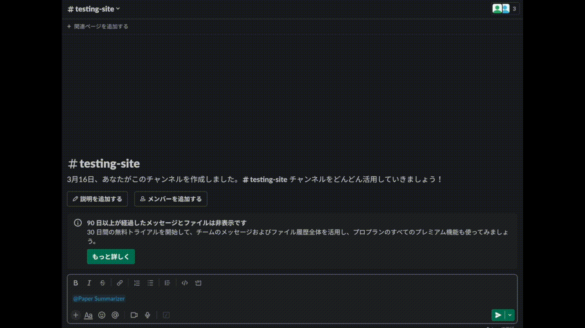

# Paper Summarizer

**A Slack Bot of paper summarization for arXiv papers, powered by OpenAI LLMs.**

<p align="center">
  
</p>

## Features

This repository offers 2 main features:

- **Summarize an arXiv paper which you mention in a Slack channel.**
- **Once a day, post summaries of papers which [AK](https://twitter.com/_akhaliq) mentions.**

Currently, the bot supports only papers posted on [arXiv](https://arxiv.org/).

## How to use

### 0. Get API keys for OpenAI and Slack

- OpenAI: [https://platform.openai.com/account/api-keys](hhttps://platform.openai.com/account/api-keys)
- Slack: [https://api.slack.com/apps](https://api.slack.com/apps)

### 1. Add the bot to your Slack workspace and make it be able to react with user's mention

- This article may be helpful: [Enabling interactions with bots](https://api.slack.com/bot-users)

### 2. Clone this repository

```bash
git clone https://github.com/discus0434/paper-summarizer.git
```

### 3. Build a Docker image

If you do not use CUDA (i.e., you use only CPU), you can modify `Dockerfile` as follows:

```diff
- FROM paddlepaddle/paddle:2.4.1-gpu-cuda11.2-cudnn8.2-trt8.0
+ FROM paddlepaddle/paddle:2.4.1
```

Then, build a Docker image:

```bash
cd paper-summarizer/docker && make run
```

### 4. Set environment variables

`OPENAI_ORGANIZATION` might be optional.

```bash
echo "OPENAI_ORGANIZATION=org-XXX" >> .env
echo "OPENAI_API_KEY=sk-XXX" >> .env
echo "SLACK_INCOMING_WEBHOOK_URL=https://hooks.slack.com/services/XXX/XXX/XXX" >> .env
echo "SLACK_SIGNING_SECRET=XXX" >> .env
echo "SLACK_BOT_TOKEN=xoxb-XXX" >> .env
```

### 5. Run the API and forward the port

You can run the API with the following command:

```bash
make run
```

Then, forward the port by using [ngrok](https://ngrok.com/) or something like that.

## Requirements

- Computer with x86-64 architecture
- Docker

## License

This repository is licensed under AGPLv3. See [LICENSE](./LICENSE.txt) for more information.

## References

- For PDF to text conversion, using [PaddlePaddle](https://github.com/PaddlePaddle/PaddleOCR) model.
- The docker image is based on [paddlepaddle/paddle](https://hub.docker.com/r/paddlepaddle/paddle/tags/).
